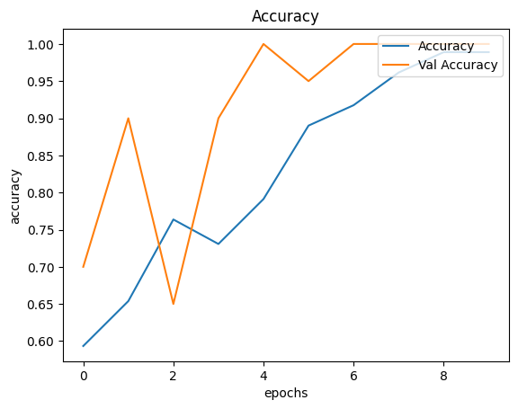
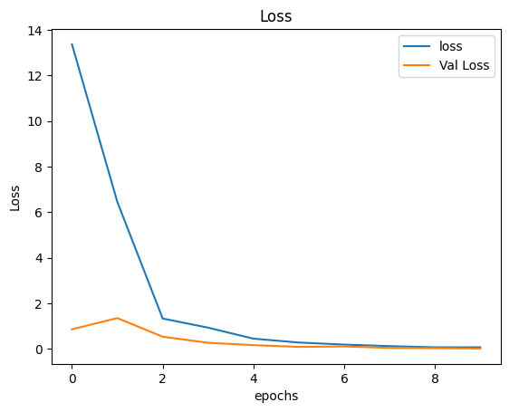
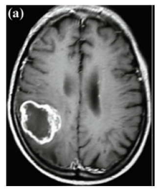

# Brain Tumor MRI Classification with CNN

Projek ini bertujuan untuk mendeteksi keberadaan **tumor otak** dari gambar MRI menggunakan model **Convolutional Neural Network (CNN)**. Dengan pendekatan deep learning, sistem ini dapat membedakan apakah sebuah gambar MRI menunjukkan adanya tumor atau tidak.

---

## Teknologi yang Digunakan

| Teknologi / Library  | Fungsi                                                                 |
|----------------------|------------------------------------------------------------------------|
| Python               | Bahasa pemrograman utama proyek ini                                    |
| TensorFlow / Keras   | Membangun, melatih, dan menyimpan model CNN                            |
| OpenCV               | Manipulasi gambar tambahan (opsional, untuk augmentasi atau testing)   |
| Pillow (PIL)         | Pemrosesan gambar: resize, convert ke RGB                              |
| Matplotlib           | Visualisasi data dan hasil pelatihan model                             |
| NumPy                | Operasi matematis dan array                                            |
| os / io              | Load dataset dan handle upload file di runtime                         |

---

## Arsitektur Model

Model CNN yang digunakan cukup sederhana namun efektif untuk klasifikasi biner:

| Layer              | Fungsi                                                                 |
|--------------------|------------------------------------------------------------------------|
| `Conv2D` + `ReLU`  | Mengekstrak fitur visual dari gambar melalui filter konvolusi          |
| `MaxPooling2D`     | Menurunkan dimensi spasial dan komputasi                               |
| `Flatten`          | Mengubah hasil layer konvolusi menjadi vektor 1 dimensi                |
| `Dense`            | Fully connected layer untuk belajar representasi dari fitur gambar     |
| `Dropout`          | Mencegah overfitting dengan menonaktifkan sebagian neuron secara acak  |
| `Dense (sigmoid)`  | Output layer untuk klasifikasi biner (0 = tanpa tumor, 1 = tumor)      |

- Input gambar berukuran `224x224 piksel` dan berwarna (RGB).

---

## Cara Kerja Sistem

1. **Persiapan data**  
   Gambar dari dataset diubah ukurannya jadi 224x224 dan dinormalisasi.

2. **Pelatihan model**  
   Model dilatih selama beberapa epoch dengan data yang sudah dibagi antara training, validation, dan testing.

3. **Prediksi gambar baru**  
   Setelah model dilatih, upload gambar MRI baru (misal dari Google) dan sistem akan memprediksi apakah ada tumor atau tidak.

---

## Hasil & Visualisasi

Model mencapai akurasi sekitar **88%**, cukup stabil dan konsisten selama proses pelatihan. Grafik berikut menunjukkan bagaimana akurasi dan loss berkembang:

### Akurasi Model


### Loss Model


Berikut ini contoh prediksi model terhadap gambar MRI baru:



- Dengan menggunakan gambar tersebut, model berhasil mendeteksi adanya tumor di foto tersebut.

---

## Struktur Folder

```
├── CNN_Brain_Tumor.ipynb       # Notebook utama (semua proses ada di sini)
├── image-1.png                 # Grafik Akurasi
├── image-2.png                 # Grafik Loss
├── image.png                   # Gambar MRI baru untuk prediksi
└── README.md
```